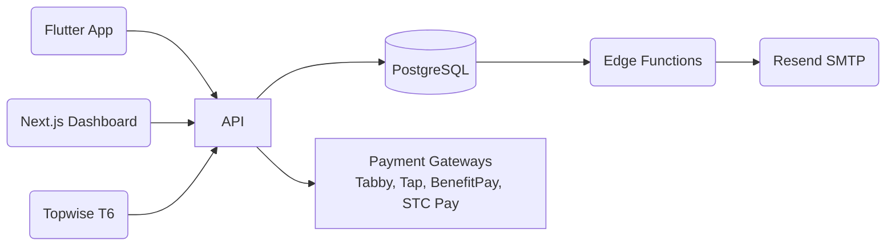
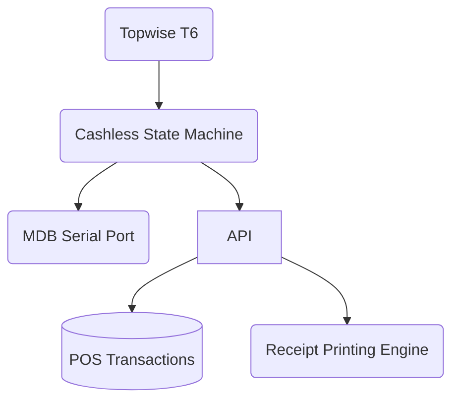

# 🧑‍💻 CTO • Senior Software Engineer • AI & FinTech Builder  
### Co-Founder & CTO @ DHD Software Development | Senior Software Engineer @ Some Company

Hi 👋 I’m **Nasser**, a **Senior Software Engineer**, **CTO**, and **multi-startup founder** building next-generation digital products in **FinTech, E-commerce, AI SaaS, POS**, and **Enterprise Systems**.

I focus on highly scalable systems, modern app architecture, and production-ready engineering across **mobile, backend, cloud, POS hardware, and AI integrations**.

---

## 🦾 Expertise

### 💳 FinTech & Payment Systems
- POS / SoftPOS (Topwise - Sunmi)  
- BenefitPay QR, Apple Pay / Google Pay  
- Payment gateways: Tabby, Tap, Binance Pay, STC Pay  
- Settlement flows, DCC, secure receipt printing  
- MDB Vending Machine Protocols (Cashless, Serial Communication)

### 📱 Mobile & Frontend Engineering
- Flutter (iOS, Android, Web, macOS, Windows)  
- Riverpod, BLoC, Material 3, animations  
- Next.js 14, Tailwind, Shadcn UI, Framer Motion

### 🧠 AI Engineering
- LLM integrations (Azure OpenAI, GPT-4o/mini)  
- AI agents, tools, chat workflows  
- Embeddings, RAG, vector search

### 🛠 Backend & DevOps
- Supabase (PostgreSQL + RLS + Edge Functions)  
- Node.js, Deno, Java Spring Boot  
- Docker, CI/CD (GitHub Actions, Xcode Cloud, Vercel)  
- Cloud services: Vercel, Google Cloud, AWS

---

# 🧰 Tech Stack

### Languages  
`Dart` `TypeScript` `JavaScript` `Java` `SQL` `Python` `Kotlin`

### Frameworks & Tools  
`Flutter` `Next.js` `Spring Boot` `Supabase` `Node.js` `Deno`  
`Docker` `Vercel` `Stripe` `GitHub Actions`

### Databases  
`PostgreSQL` `Supabase` `SQLite` `Redis`

---

## 📊 GitHub Stats

---

---

# 🧱 System Architecture Diagrams (Mermaid)

### E-Commerce + Wallet + Admin Ecosystem

### POS Payment Terminal Architecture

---

# 🧬 Skills Matrix

| Category | Skills |
|---------|--------|
| **Mobile** | Flutter, Riverpod, Material 3, CI/CD |
| **Web** | Next.js, Tailwind, Shadcn UI, SSR/ISR |
| **Backend** | Supabase, Node.js, Java Spring Boot |
| **Databases** | PostgreSQL, RLS, SQL Optimization |
| **AI/LLM** | Chatbots, Azure OpenAI, embeddings |
| **FinTech** | BenefitPay, Tabby, Tap, STC Pay, QR |
| **POS Hardware** | Topwise T6, MDB protocol, cashless logic |
| **DevOps** | Docker, GitHub Actions, Vercel, Xcode Cloud |

---

# 🚀 Highlighted Projects

### 📦 Abaya Elegance – Multi-Platform E-Commerce App
- Flutter (6 platforms)
- Supabase backend
- Partial payments, wallet, order tracking
- Merchant dashboard + landing page

### 💳 POS / SoftPOS Payment System
- Topwise T6  
- QR + card payments  
- Receipt printing & reconciliation  
- Full settlement flow  

### 🤖 DHD AI Assistant Platform
- Multi-agent system  
- Commands, tools, actions  
- Billing + Stripe integration  
- Web dashboards + chat playground  

---

# 🔗 Find Me Online
- 🌐 Website: **https://dhdhub.com**  
- 💼 LinkedIn: **https://linkedin.com/in/nasser-almeel**  
- ✉️ Email: **naser@dhdhub.com**

